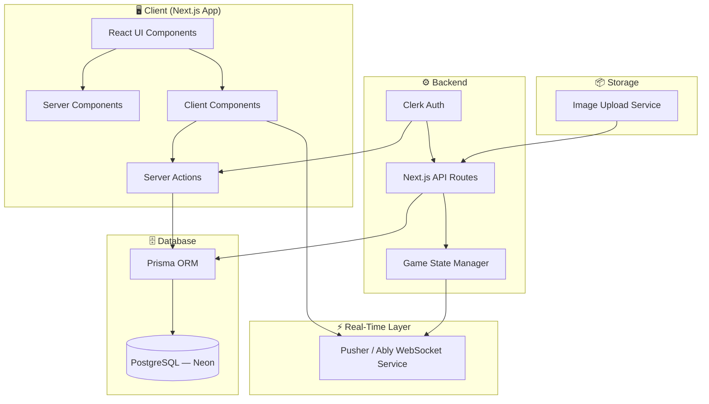
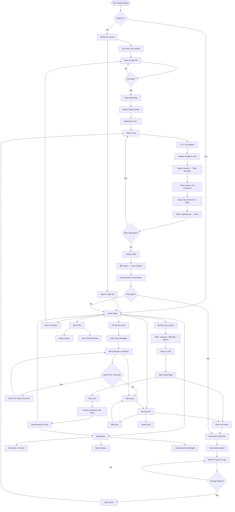
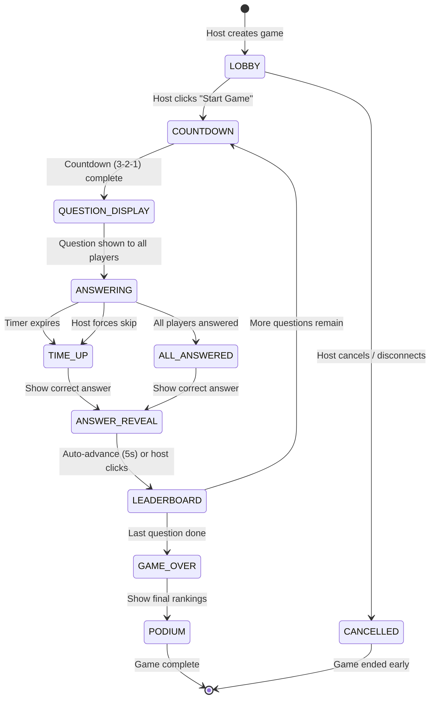
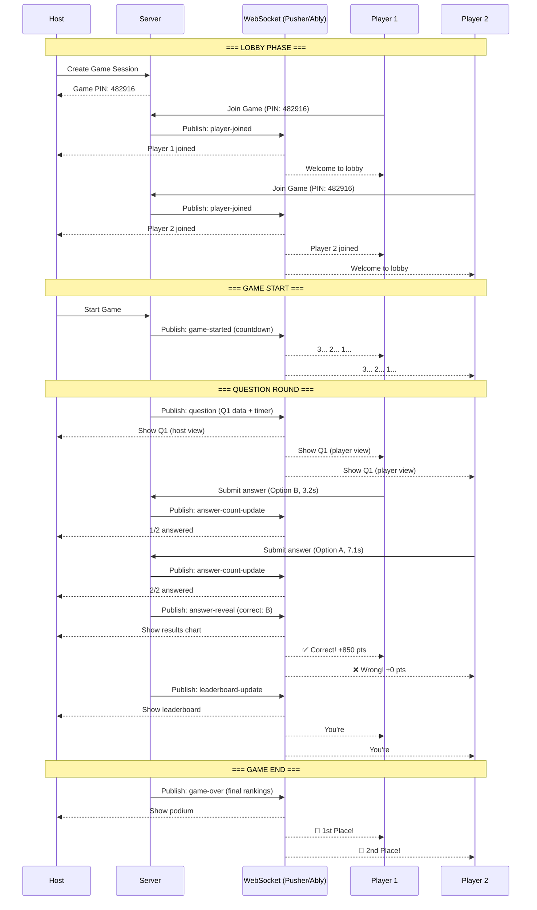
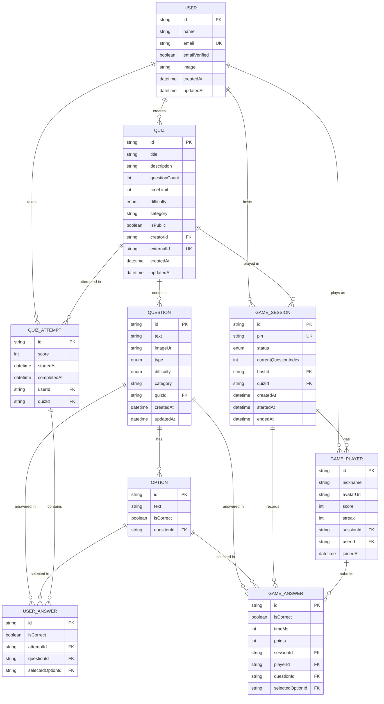
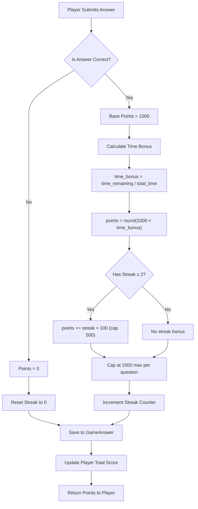
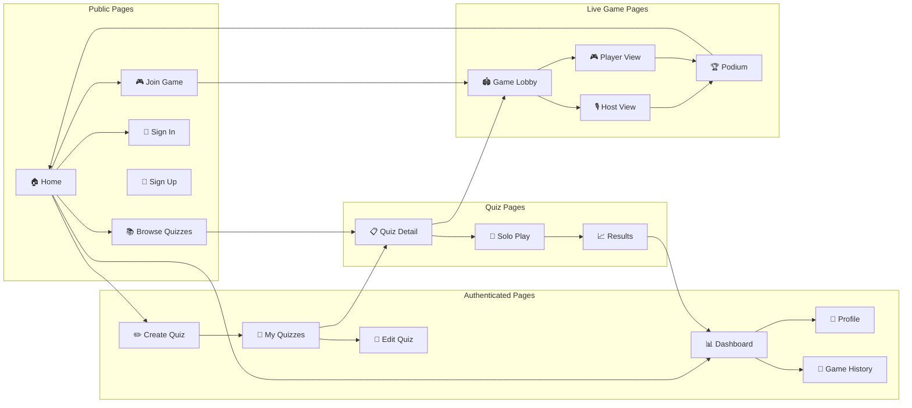
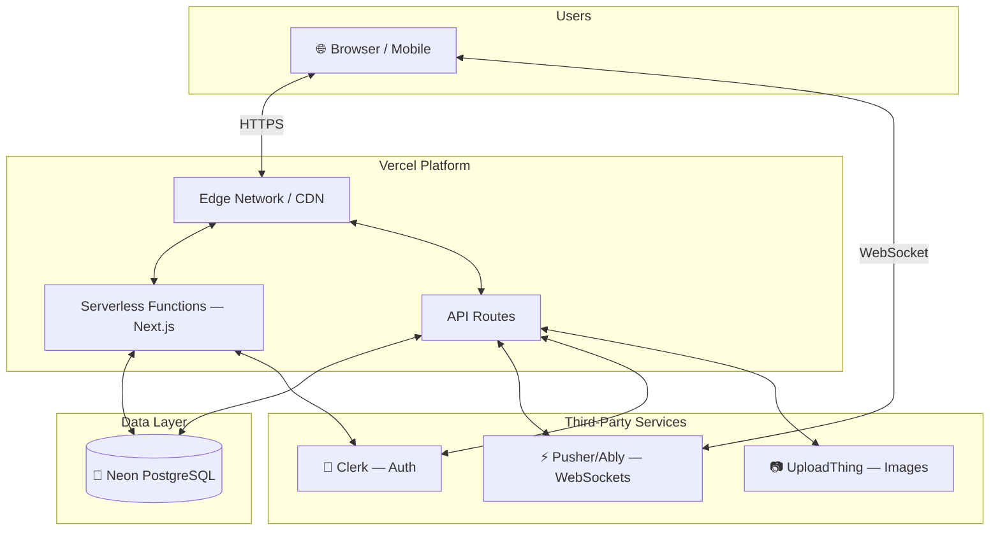

# 🔀 Quizzy — End Goal System Flowchart

> Visual architecture and user flow diagrams for the complete Kahoot-like quiz platform.
> All diagrams use Mermaid syntax — render in GitHub, VS Code (with Mermaid extension), or mermaid.live

---

## 1. High-Level System Architecture



---

## 2. Complete User Journey Flowchart



---

## 3. Live Game State Machine



---

## 4. Real-Time Communication Flow



---

## 5. Database Entity Relationship Diagram



---

## 6. Scoring Algorithm Flow



---

## 7. Page Navigation Map



---

## 8. Deployment Architecture



---

## 9. Feature Priority Matrix

```
                        HIGH IMPACT
                            │
            ┌───────────────┼───────────────┐
            │               │               │
            │  🔴 DO FIRST  │  🟡 DO NEXT   │
            │               │               │
            │ • Quiz Creator│ • Animations  │
            │ • Live Game   │ • Sound FX    │
            │ • Game Lobby  │ • Achievements│
            │ • Leaderboard │ • Sharing     │
            │ • Scoring     │ • Avatars     │
 HIGH ──────┼───────────────┼───────────────┼────── LOW
 EFFORT     │               │               │  EFFORT
            │  🟠 CONSIDER  │  🟢 EASY WINS │
            │               │               │
            │ • Teams Mode  │ • Dark Mode ✅│
            │ • Video Q's   │ • Filters ✅  │
            │ • AI Quizzes  │ • Search      │
            │ • Tournaments │ • OG Images   │
            │               │               │
            └───────────────┼───────────────┘
                            │
                        LOW IMPACT
```

---

> **How to view these diagrams:**
> - **GitHub:** Push this file — GitHub renders Mermaid natively
> - **VS Code:** Install "Markdown Preview Mermaid Support" extension
> - **Browser:** Copy any diagram block to [mermaid.live](https://mermaid.live)
